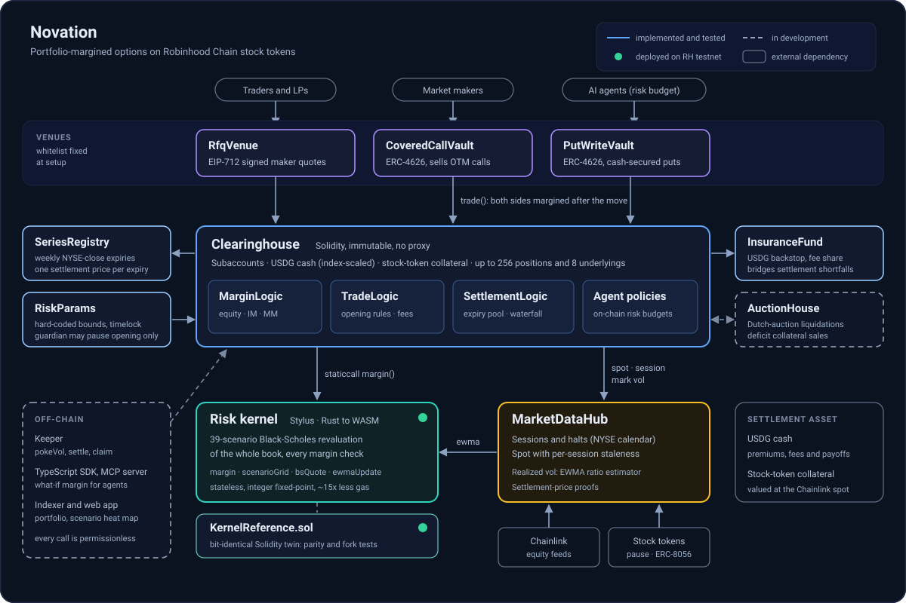

# Novation

Portfolio-margined options on Robinhood Chain stock tokens. Every margin check re-prices the whole book across 39 scenarios in a Stylus risk kernel, for about 15x less gas than hand-optimized Solidity.

Robinhood Chain testnet (chain id 46630): the Stylus kernel, its Solidity twin and the core contracts are live. Internally reviewed, not externally audited. Judges can start with [JUDGES.md](JUDGES.md).

Live app: [novation-clearing.vercel.app](https://novation-clearing.vercel.app) (the app runs on a demo snapshot computed with the kernel reference; the contracts it describes are live on testnet).

## What Novation is

Novation is a clearinghouse for weekly European options on the tokenized US stocks that trade on Robinhood Chain, starting with NVDA, TSLA, SPY and AAPL. Options are cash-settled in USDG at the Friday NYSE close. Trades reach the clearinghouse only through venues: an RFQ venue for EIP-712 signed maker quotes, and two option-selling vaults (covered calls and cash-secured puts). An owner can let an AI trading agent trade for an account under an on-chain risk budget, which caps the worst-case loss the account may carry rather than the amount the agent may spend.

Each account is margined as one portfolio. Its options and its stock-token collateral are re-priced with Black-Scholes across a grid of price and volatility scenarios, and the worst loss sets the margin. A covered call is covered by the stock already in the account, a spread is margined on its real worst case, and a hedge reduces the requirement. The grid runs in a stateless risk kernel written in Rust and deployed with Arbitrum Stylus; a bit-identical Solidity twin exists to check that it computes the same integers.

## Why it matters

Robinhood Chain carries tokenized US stocks with Chainlink price feeds, and contracts can hold them like any ERC-20: a transfer checks only a pause flag and a blocklist. They trade against USDG in DEX pools, but we found no options market on the chain to hedge a position or to earn premium on one.

The tokens also trade around a hole in the price data. The equity feeds publish five days a week. Across 13 weeks of mainnet history there was not one round on a Saturday or on a Sunday before 20:00 ET, and only a handful after 16:00 on a Friday: a typical weekend leaves 52 to 60 hours without a price, and a holiday weekend 76 to 81 hours. There is no round at the Friday 16:00 ET close either. On 2026-09-18 the last SPY print before the close came at 08:22 ET, and the next one at 20:00 ET on Sunday. A margin engine that treats Friday 16:00 like any other minute under-reserves for the Monday gap, and a settlement that assumes a closing print waits for one that never comes.

Novation encodes the NYSE calendar on-chain. Margin shocks widen by session (1.75x over weekends and holidays by default), opening halts when a feed goes stale or the issuer freezes the token, settlement proves the last print at or before the close from the feed itself, and liquidation auctions are designed to wait for a live price instead of selling into the gap.

## How margin works

The full model, with every parameter and its bounds, is in [docs/risk-model.md](docs/risk-model.md). In short:

1. **Scenarios.** Each underlying gets 13 price moves, evenly spaced from minus to plus its shock range, times 3 volatility levels (30% lower, unchanged, 40% higher): 39 scenarios. In the correlated regime every underlying moves by the same fraction of its own range.
2. **Shock range.** `max(10%, 3 × σ × √(2/365)) × session multiplier`, capped at 90%. σ is the mark volatility: a realized-volatility estimate built on-chain from Chainlink rounds, clamped between a per-underlying floor and cap.
3. **Sessions.** The multiplier is 1.0 in the regular session, 1.2 in extended hours, 1.75 over weekends and holidays and 2.5 when the underlying is halted.
4. **Requirement.** Initial margin (IM) is the larger of the correlated worst loss and 70% of the sum of each underlying's own worst loss, plus 1% of spot per short option. Maintenance margin (MM) is 75% of IM. Equity is cash plus the mark-to-market of options and collateral.
5. **The kernel.** Every trade, margin-checked withdrawal and what-if view sends the account's whole book to the kernel's `margin()` function and gets back its mark-to-market, its worst-case loss and the worst scenario.

Each side of a trade that opens risk must end with equity at or above IM. Reducing risk stays possible below IM: a side that grows no position, doesn't raise the worst-case loss and doesn't give up equity against the mark passes the margin check.

## The margin check that doesn't fit in an EVM transaction

Each margin check prices every option in the account 39 times. In the EVM that costs about 92,500 gas per position, even in hand-optimized Solidity. The Stylus kernel costs about 5,000.

Execution gas of one `margin()` call on Robinhood Chain testnet:

| Positions | Stylus kernel | Hand-optimized Solidity | Ratio |
|---|---|---|---|
| 32 | 199,415 | 2,922,648 | 14.7x |
| 64 | 351,072 | 5,828,423 | 16.6x |
| 128 | 685,075 | 11,646,851 | 17.0x |
| 256 | 1,323,108 | 23,269,339 | 17.6x |

Arbitrum caps a transaction at 32M gas. A trade evaluates margin once for a side that opens risk, and twice (before and after the trade) for a side that reduces risk or is acted on by an agent. Closing one position in an account at the 256-position cap therefore takes two full evaluations of that account: about 46.5M gas with hand-optimized Solidity, which no transaction can hold, and 2.6M with the Stylus kernel. A single Solidity evaluation stops fitting at about 345 positions.

The ratio above uses the conservative baseline: a separate Solidity implementation of the same 39-scenario revaluation, written for gas (unchecked arithmetic, inlined constants). For context, `KernelReference.sol`, the checked Solidity twin used for parity, costs 21.3M gas at 32 positions, about 100x the Stylus kernel; it isn't the headline because it was never tuned for gas. Methods, books, dates and the raw transaction-level numbers are in [docs/gas.md](docs/gas.md).

Both kernels are live on testnet, and anyone can compare them on identical calldata:

```bash
python tools/stylus-deploy/parity.py --rpc https://rpc.testnet.chain.robinhood.com
```

The script checks that the two return byte-identical results and prints `eth_estimateGas` for both. On 2026-10-01 a 32-position book estimated at 269,605 gas on the Stylus kernel and 22,099,291 on the Solidity twin; the 256-position book estimated at 1,671,146 on Stylus and exceeds the RPC's 50M call allowance on Solidity.

## Architecture



- **Venues** are the only callers of `Clearinghouse.trade`. The list is fixed when setup ends. Each venue passes the actor for each side; the clearinghouse checks that the actor is the account owner or a live agent of that account.
- **Clearinghouse** keeps subaccounts, USDG cash (scaled by a global cash index that only a socialized loss can lower), stock-token collateral and positions. Its logic lives in three linked libraries: `MarginLogic` builds the kernel input, `TradeLogic` applies the opening rules, fees, margin and agent budgets, `SettlementLogic` runs the expiry pool and the default waterfall.
- **Risk kernel** is a stateless Rust program compiled to WASM: `margin`, `scenarioGrid` (the 39-value heat map), `bsQuote` and `ewmaUpdate`. `KernelReference.sol` implements the same interface and returns the same integers.
- **MarketDataHub** turns a Chainlink feed and a stock token into a session (regular, extended, weekend, holiday or halted), a spot price, a mark volatility and a proven settlement price. Every halt condition fails closed.
- **SeriesRegistry** lists series permissionlessly (weekly NYSE-close expiries, strike grid, distance from spot) and stores one settlement price per underlying and expiry.
- **RiskParams** holds every risk and fee parameter inside hard-coded bounds. Only a timelock can change them; a guardian can only pause opening.
- **InsuranceFund** receives a share of fees and bridges settlement shortfalls. **AuctionHouse** runs Dutch-auction liquidations and the sale of a defaulter's collateral.

| Component | Status |
|---|---|
| Risk kernel (Stylus) and `KernelReference.sol` | Implemented, deployed on RH testnet |
| Clearinghouse with margin, trading, agent budgets and the settlement waterfall | Implemented and tested, deployed on RH testnet |
| MarketDataHub, SeriesRegistry, RiskParams, InsuranceFund | Implemented and tested, deployed on RH testnet |
| RfqVenue, CoveredCallVault, PutWriteVault | Implemented and tested, deployed on RH testnet |
| AuctionHouse (liquidations, deficit sales) | Implemented and tested, deployed on RH testnet |
| Keeper, TypeScript SDK, MCP server for agents, indexer, web app | In development |
| Robinhood Chain mainnet deployment | Planned |

## Contracts and addresses

Robinhood Chain testnet, chain id 46630. The machine-readable copy is [`contracts/deployments/46630.json`](contracts/deployments/46630.json), and [docs/deployments.md](docs/deployments.md) lists every mock token and feed.

| Contract | Address | State |
|---|---|---|
| Risk kernel (Stylus) | [`0xAeE1D4F45AF43a9C4d52ADa65d423b1c0e67f0fd`](https://explorer.testnet.chain.robinhood.com/address/0xAeE1D4F45AF43a9C4d52ADa65d423b1c0e67f0fd) | deployed, activated |
| KernelReference (Solidity twin) | [`0xB7d9232c8ff46b4950d85ed639908c86C08750C6`](https://explorer.testnet.chain.robinhood.com/address/0xB7d9232c8ff46b4950d85ed639908c86C08750C6) | deployed |
| Mock USDG, NVDA, TSLA, AAPL, SPY and their feeds | see [docs/deployments.md](docs/deployments.md) | deployed, testnet only ([MOCKS.md](MOCKS.md)) |
| RiskParams | [`0x5Ec7F77cee13E6c246F80AAaa466992210e17F6f`](https://explorer.testnet.chain.robinhood.com/address/0x5Ec7F77cee13E6c246F80AAaa466992210e17F6f) | deployed, setup finalized |
| MarketDataHub | [`0x2BFFfa823cFcCfd703793320883134aC009a5a51`](https://explorer.testnet.chain.robinhood.com/address/0x2BFFfa823cFcCfd703793320883134aC009a5a51) | deployed |
| SeriesRegistry | [`0x4A8bD72CD6e2Cd743c2f103447B47cFf0B22cC77`](https://explorer.testnet.chain.robinhood.com/address/0x4A8bD72CD6e2Cd743c2f103447B47cFf0B22cC77) | deployed, 128 series listed |
| InsuranceFund | [`0x9826E96ec14Ff888626E4c6Cf44224925671D1fF`](https://explorer.testnet.chain.robinhood.com/address/0x9826E96ec14Ff888626E4c6Cf44224925671D1fF) | deployed, funded with 100,000 mock USDG |
| Clearinghouse (with MarginLogic, TradeLogic, SettlementLogic, AuctionHookLogic) | [`0xe799DF9b96a4809c411D3F90f67C5261a245ABB2`](https://explorer.testnet.chain.robinhood.com/address/0xe799DF9b96a4809c411D3F90f67C5261a245ABB2) | deployed, setup finalized |
| AuctionHouse | [`0x0a7590A4C07604D738ab3DDe18306e3026a7Cf0B`](https://explorer.testnet.chain.robinhood.com/address/0x0a7590A4C07604D738ab3DDe18306e3026a7Cf0B) | deployed |
| RfqVenue | [`0x56562573b74A6cD6ca96cfb794A63625A48edf08`](https://explorer.testnet.chain.robinhood.com/address/0x56562573b74A6cD6ca96cfb794A63625A48edf08) | deployed |
| CoveredCallVault NVDA | [`0x5e36BbAc665244f623cf8195b7a753Ad61D8bacA`](https://explorer.testnet.chain.robinhood.com/address/0x5e36BbAc665244f623cf8195b7a753Ad61D8bacA) | deployed, seeded |
| CoveredCallVault TSLA | [`0x684Fc5aE66267E8184704f6A3cE393f0c18B1095`](https://explorer.testnet.chain.robinhood.com/address/0x684Fc5aE66267E8184704f6A3cE393f0c18B1095) | deployed, seeded |
| PutWriteVault NVDA | [`0x691E99fb5498570F4A0AB8a74aAAE3361c0E0a3a`](https://explorer.testnet.chain.robinhood.com/address/0x691E99fb5498570F4A0AB8a74aAAE3361c0E0a3a) | deployed, seeded |
| TimelockController (60 s on testnet) | [`0x5eb54aa55f3e03b7F50b7aFD22F235FB0e85235F`](https://explorer.testnet.chain.robinhood.com/address/0x5eb54aa55f3e03b7F50b7aFD22F235FB0e85235F) | deployed |

The end-to-end run on this deployment (deposits, a vault buy and a vault deposit, an RFQ fill, an agent budget, a withdrawal blocked by margin and an opening blocked by a corporate action, with every transaction hash) is in [`tools/e2e/out/46630.json`](tools/e2e/out/46630.json).

## Security model

The full trust model, invariants, threat table and review history are in [SECURITY.md](SECURITY.md). The short version:

- The core is immutable. There are no proxies, no `selfdestruct` and no `delegatecall` outside linked libraries.
- Risk parameters change only through a timelock, and every setter enforces hard-coded bounds. The guardian can pause opening and nothing else: withdrawals, risk-reducing trades and settlement stay open.
- The venue list and the auction house are fixed when setup is finalized.
- Prices come from Chainlink only. Any doubt about a feed or a token (stale, unreadable, out of the plausibility band, paused, mid corporate action) reads as HALTED, which blocks opening and widens margin.
- Settlement prices are proven from the feed's own round history, with no admin override.
- Rounding goes against the actor: requirements and debts round up, credits and payouts round down.
- The Stylus kernel, the Solidity twin and a Python reference agree bit for bit on every test vector. A differential fuzz of 5,100 random calls, run against `KernelReference` on a local node, found no difference in return data or revert data.

## Honest limits

- Mark volatility is realized volatility from Chainlink rounds, not implied volatility. Vault premiums add model parameters (skew, spread) on top of it.
- Options are weekly, European and cash-settled. Settlement uses the last feed print at or before the close, which can be hours old.
- Liquidation and deficit auctions pause over weekends and while an underlying is halted, by design. A gap larger than the weekend shock can still create bad debt; it goes through the waterfall and, as a last resort, the cash index.
- While a feed returns no usable price (unreadable, zero or outside the plausibility band), stock tokens held only as collateral are valued at 0. An account with options on that underlying can't withdraw, trade or be liquidated until the feed recovers.
- An agent's value-drain cap applies per trade. Many trades can add up to more than one cap; owners should size budgets and expiries with that in mind. Revoking an agent takes effect immediately.
- The Stylus program expires 365 days after activation. It must be kept alive (anyone can pay for that through ArbWasm), or every margin check fails.
- The stock-token issuer can pause transfers, blocklist addresses and burn tokens from any holder with `adminBurn`, the clearinghouse included.
- The NYSE holiday table covers 2026 and 2027. The contracts are immutable, so later years need a new deployment.
- 1 USDG is treated as 1 USD.
- Stock tokens are not available to US persons, and Novation inherits the issuer's restrictions. Derivatives on tokenized securities raise regulatory questions this build doesn't answer.
- On-chain portfolio margin exists elsewhere, for example Derive on its own chain. Novation's contribution is the stock-token market on Robinhood Chain, a Stylus kernel with measured gas, and scenarios that know the trading calendar.

Every public claim, with its evidence, is listed in [CLAIMS.md](CLAIMS.md).

## Repository layout

```text
contracts/                 Foundry project
  src/core/                Clearinghouse, RiskParams, MarketDataHub, SeriesRegistry, InsuranceFund
  src/core/logic/          MarginLogic, TradeLogic, SettlementLogic (linked libraries)
  src/kernel/              KernelReference.sol, the Solidity twin of the kernel
  src/libraries/           FixedPointMath, BlackScholes, NyseCalendar
  src/venues/              RfqVenue, CoveredCallVault, PutWriteVault
  src/mocks/               testnet-only tokens and feeds
  test/                    unit and fuzz tests; test/vectors holds the shared parity vectors
  deployments/             addresses per chain id
kernel/                    Stylus risk kernel (Rust, stylus-sdk 0.10.9)
  src/                     fixed-point math, Black-Scholes, scenario grid, EWMA, ABI codec
  tests/                   parity, codec and exported-ABI tests
  bench/                   wasm instruction counts, on-chain gas probe, differential fuzz
tools/
  ref/                     Python reference and vector generator
  stylus-deploy/           build checks, deploy and activation, on-chain parity
  mirror-feeds.py          mirrors mainnet Chainlink rounds into the testnet mock feeds
docs/                      risk model, gas, deployments, architecture diagram
```

## Run it

Prerequisites: [Foundry](https://getfoundry.sh), Rust (the toolchain is pinned in `kernel/rust-toolchain.toml`), Python 3 for the tools, and Node with pnpm 9 for the app.

```bash
git clone --recurse-submodules https://github.com/RaYYeR220/novation.git novation
cd novation/contracts && forge build && forge test
cd ../kernel && cargo test --test parity
```

`forge test` runs the Solidity suites, including the parity vectors and the 256-position cap. `cargo test --test parity` checks the Rust kernel against the same vectors, integer for integer. `cargo test --release` runs the full kernel suite.

The on-chain tools need a few Python packages:

```bash
pip install requests eth-abi eth-account eth-utils brotli
python tools/stylus-deploy/parity.py --rpc https://rpc.testnet.chain.robinhood.com
```

To build the WASM program and check that it fits the 24 KB Stylus limit (needs `wasm-tools`):

```bash
cd kernel && cargo build --release --target wasm32-unknown-unknown
python ../tools/stylus-deploy/deploy.py --check-size target/wasm32-unknown-unknown/release/novation_kernel.wasm
```

The web app lives in `app/` and uses pnpm:

```bash
pnpm install
pnpm --filter @novation/app dev
```

The RFQ market maker in `mm-bot/` prices, margin-checks and signs quotes over HTTP: `pnpm --filter @novation/mm-bot start` (setup and endpoints in [mm-bot/README.md](mm-bot/README.md)).

## License

[MIT](LICENSE)
